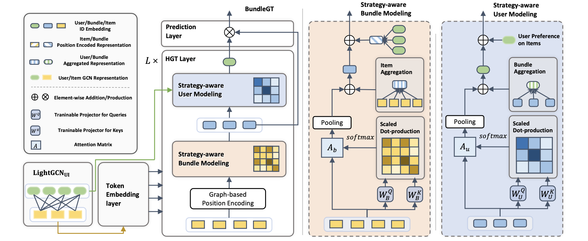

# Strategy-aware Bundle Recommender System
Yinwei Wei, Xiaohao Liu, Yunshan Ma, Xiang Wang, Liqiang Nie and Tat-Seng Chua, [SIGIR'23](https://dl.acm.org/doi/10.1145/3539618.3591771)



## Introduction
Bundle Graph Transformer, termed BundleGT, is a novel model for bundle recommendation, which explore the strategy-aware user and bundle representations for user-bundle interaction prediction. BundleGT consists of the token embedding layer, hierarchical graph transformer (HGT) layer, and prediction layer.

## Citation
If you want to use our codes and datasets in your research, please cite:

``` 
@inproceedings{BundleGT2023,
  author    = {Yinwei Wei and
               Xiaohao Liu and
               Yunshan Ma and
               Xiang Wang and
               Liqiang Nie and
               Tat{-}Seng Chua},
  title     = {Strategy-aware Bundle Recommender System},
  booktitle = {{SIGIR}},
  publisher = {{ACM}},
  year      = {2023}
}
``` 

## Environment Requirement
- python == 3.7.3 or above
- supported(tested) CUDA versions: 10.2
- Pytorch == 1.9.0 or above

## Code Structure
1. The entry script for training and evaluation is: [main.py](https://github.com/Xiaohao-Liu/BundleGT/blob/master/main.py).
2. The config file is: [config.yaml](https://github.com/Xiaohao-Liu/BundleGT/blob/master/config.yaml).
3. The script for data preprocess and dataloader: [utility.py](https://github.com/Xiaohao-Liu/BundleGT/blob/master/utility.py).
4. The model folder: [./models](https://github.com/Xiaohao-Liu/BundleGT/tree/master/models).
5. The experimental logs in tensorboard-format are saved in ./runs.
6. The experimental logs in txt-format are saved in ./log.
7. The best model and associate config file for each experimental setting is saved in ./checkpoints.

To facilitate understanding and implementation of our model code, we have divided it into four parts:

1. [BundleGT.py](https://github.com/Xiaohao-Liu/BundleGT/blob/main/models/BundleGT/BundleGT.py), which contains the main Bundle Graph Transformer model,
2. [LGCN.py](https://github.com/Xiaohao-Liu/BundleGT/blob/main/models/BundleGT/LGCN.py), which includes the LightGCN module,
3. [LiT.py](https://github.com/Xiaohao-Liu/BundleGT/blob/main/models/BundleGT/LiT.py), which contains the Light self-attention module, and
4. [HGT.py](https://github.com/Xiaohao-Liu/BundleGT/blob/main/models/BundleGT/HGT.py), which includes the Hierarchical Graph Transformer module.

## How to run the code
1. Download and then decompress the dataset file into the current folder: 

   > tar -zxvf dataset.tgz
 
   Here we utilize Youshu, NetEase, and iFashion as datasets, which have the same settings as [CrossCBR](https://github.com/mysbupt/CrossCBR). The dataset can be downloaded from the CrossCBR repository in the [dataset.tgz](https://github.com/mysbupt/CrossCBR/blob/master/dataset.tgz), and we recommend citing their paper (CrossCBR).

2. Train BundleGT on the dataset Youshu:

    > python main.py -g 0 -m BundleGT -d Youshu --info="" --batch_size_test=2048 --batch_size_train=2048  --lr=1e-3 --l2_reg=1e-5 --num_ui_layer=4 --gcn_norm=0 --num_trans_layer=3 --num_token=70 --folder="train" --early_stopping=40 --ub_alpha=0.5 --bi_alpha=0.5

    There are two options available for configuring the hyperparameters: 1) modifying the file [config.yaml](https://github.com/Xiaohao-Liu/BundleGT/blob/master/config.yaml), and 2) adding command line arguments, which can be found in the file [main.py](https://github.com/Xiaohao-Liu/BundleGT/blob/master/main.py). We offer comprehensive and detailed choices for hyperparameter configuration, and we strongly recommend reading the paper to gain a better understanding of the effect of key hyperparameters.
